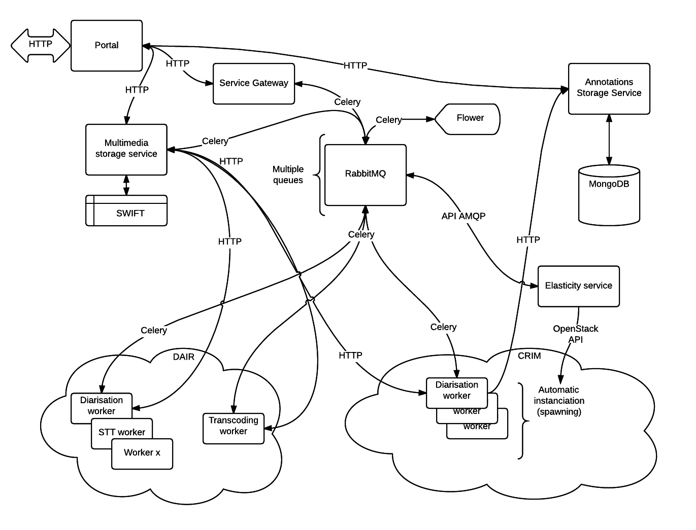

Service Gateway documentation
=============================

.. include:: ../README.rst

Vesta Ecosystem
---------------

This package is a central part in the Vesta project developed at CRIM.
Numerous other packages were developed such as:

* Multimedia file Storage System (MSS)
* JSON-LD Annotations Storage System (JASS)
* Numerous annotation services

  * Diarisation Service
  * Speech to text Service
  * Face detection Service
  * etc.

These services were developed with the Service Gateway in mind. Accordingly,
part of the documentation for the Service Gateway applies to the Service
interfaces themselves.

Concerning the MSS and JASS, it is not required that these be installed
alongside the Service Gateway yet they offer useful functionalities and some
exposed services might require them. 

Below is an illustration of the many relationships between the elements of the
Vesta Services ecosystem.

User's Guide
------------

Describes the typical usage of the Service Gateway REST API functions.

.. toctree::
   :maxdepth: 3

   user_guide

Package information
-------------------

.. toctree::
   :maxdepth: 2

   install
   configuration
   authors
   license
   provenance
   source
   release_notes

Source code documentation
-------------------------

This section documents the actual code modules for anyone interested in
interfacing with the code base or to study the code internals.

Code structure
++++++++++++++

- Shared interface between MSS and Service Gateway
- Common software package shared between MSS/Service Gateway and worker
  services, speeding up the development of new worker services.

  - Defines message format and contents along with processing methodology

Package level
+++++++++++++

.. toctree::
   :maxdepth: 2
   :glob:

   src/*

Indices and tables
==================

* :ref:`genindex`
* :ref:`modindex`
* :ref:`search`
